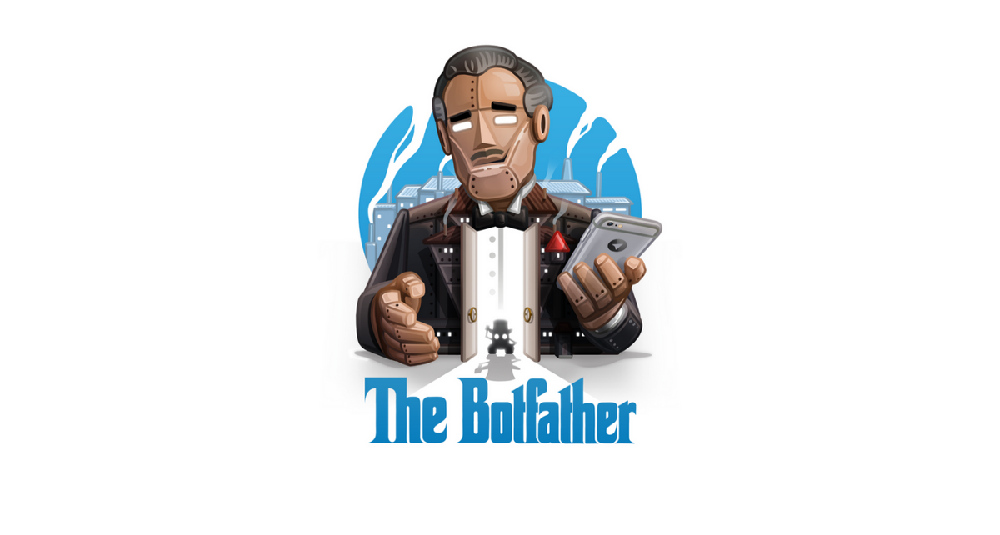
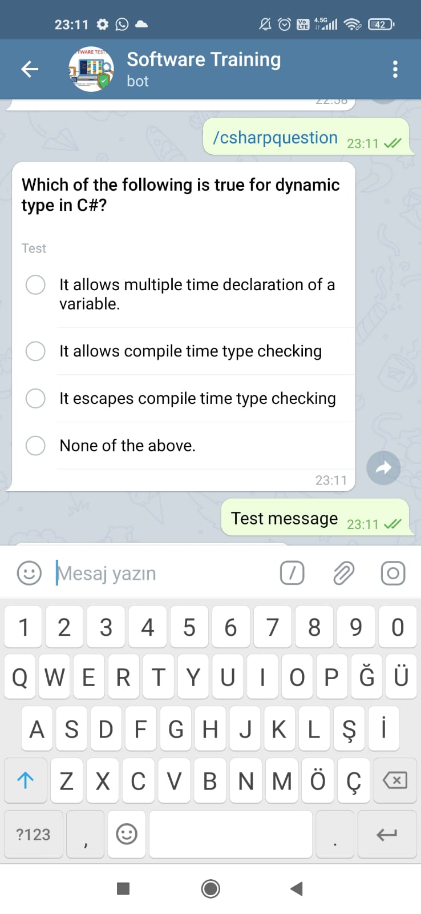
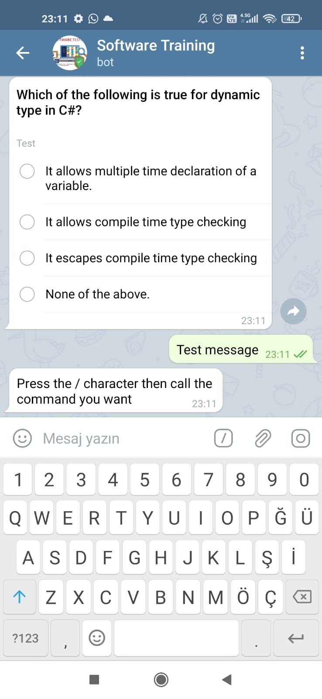

# Telegram Software Training Bot

##### To use : [Telegram: Contact @Software_Training_Bot](https://t.me/Software_Training_Bot)
##### Medium Link : [Telegram Bot By .Net Core Console](https://burakguldiken1.medium.com/net-core-console-uygulmas%C4%B1-i%CC%87le-telegram-botu-geli%C5%9Ftirmek-f05fab02c1af)

- [ ] you can take questions and practice programming languages
  
- [ ] you can consolidate your knowledge or learn new information
  
- [ ] you can make your free time efficient
  

## General

> you can list commands after pressing /
> 
> an error message will return to you when a message is sent, except for commands
> 
> C#, html,css,javascript, python, etc. question categories for programming languages will be added

# Install

you can use this link to install Telegram bot : [Telegram User Bot Kurulumu Nasıl Yapılır? - Teknoloji Haberleri (teknobilimadami.com)](https://teknobilimadami.com/telegram-user-bot-kurulumu-nasil-yapilir/)

after the bot is created, the Telegram key given to you must be saved,and then it will be needed in the application.


## Usage

- List available commands with "/" key
  
- Select the command related to the field you want among them
  
- As a result, you will be sent a relevant question.
  
- After creating the bot, save the key given for you and do not share it with anyone, you can use it as follows.
  

```c#
public TelegramClient()
        {
            telegramBotKey = "SET YOUR KEY";
        }
```

```c#
public ITelegramBotClient CreateInstance()
        {
            if(botClient == null)
            {
               lock(lockObject)
                {
                    botClient = new TelegramBotClient(telegramBotKey);
                } 
            }

            return botClient;
        }
```

- The service used to send questions can be defined as follows.Chat id value, question title, question types, poll type (in this example it can be quiz, questionnaire, etc.) should be sent as parameters.
  

```c#
public async Task ExecuteCommand(Message message,int category = 1)
        {
            var question = questionRepository.GetRandomQuestion(category);

            if(question == null)
            {
                await telegramBotClient.SendTextMessageAsync(message.Chat.Id, Messages.categoryNotFound);

                return;
            }

            await telegramBotClient.SendPollAsync(
                chatId: message.Chat.Id,
                question: question.title,
                options: new[]
                {
                    question.optionA,
                    question.optionB,
                    question.optionC,
                    question.optionD
                },
                type:PollType.Quiz,
                isAnonymous:false,
                correctOptionId: question.answer
            );
        }
```


# Photos

 
